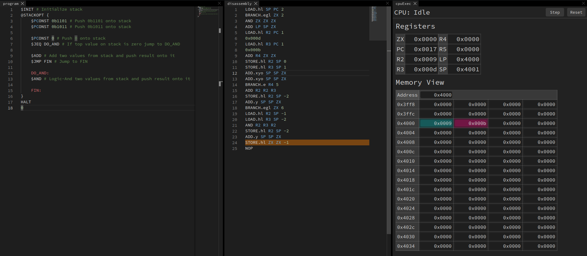

# EasyCPU

EasyCPU is a fun side-project of mine that includes:

* A design for small CPU with 8 registers (zero + pc + 6*general_purpose) and 6 commands
* A very simple [implementaion](./hdl) in system verilog
* A [toolkit](./easycpu_lib) written in rust with assembler and simulator
* Implementation of stack machine vm with optimizations
* A Web UI for development and simulation (explore it [here](https://max8rr8.github.io/easyCpu/))

* Assembler examples (available in [asm folder](./asm/))
